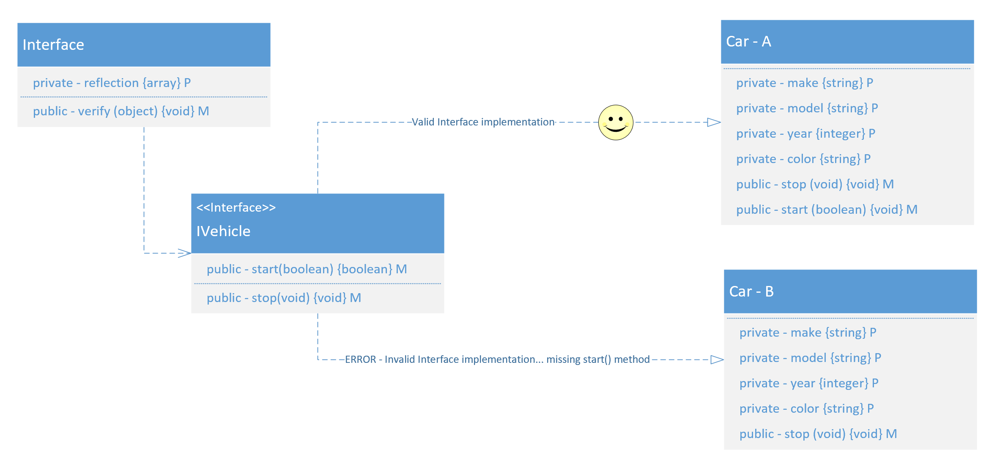

# es6-libs

A collection of APIs and reusable coding patterns for large complex architectures using ES6.

## Interface

The ```Interface``` Abstract Class is not meant to be instantiated, but to provide  an automated check of the objects claiming to implement an interface, and the intstantiated ```Interface``` object which actually represents it.
In order to implement this Interface pseudo-pattern, the abstract class must be available for any Interface object to put it on its path and inherit from it.

```javascript
const Interface = require("../objectifiers/Interface");
```

Each Definition of an API's interface must be declared as a class. The class mus provide abstract method signatures with their arguments returning an array of the argument corresponding types in the same positional order as the method signature. It would be great to find a way to account for *variable length argument signatures*. These instances of the ```Interface``` abstract class inherit the verify method and the private reflection property, and use them to verify other classes alledged implementation of the interface's methods. if there are no arguments we return null. I should add another implementation constraint **the return value type**.

```javascript
class IVehicle extends Interface {
    constructor() {
        super();
        this.start = (isReadyToRun) => {
            return [false];
        }
        this.stop = () => {
            return [null]
        }
    }
}
```


### Sample 

A class attempting to implement an interface should have an instance of that interface's class declaration added to its map of interface implementation. The interfaces map is comprised of name value pairs where the name is the string name of the interface's class declaration, and the value is an instance of said interface class.

```javascript
let ifc = this.interfaces;
ifc['ivehicle'] = new IVehicle();
ifc.ivehicle.verify(this);
```